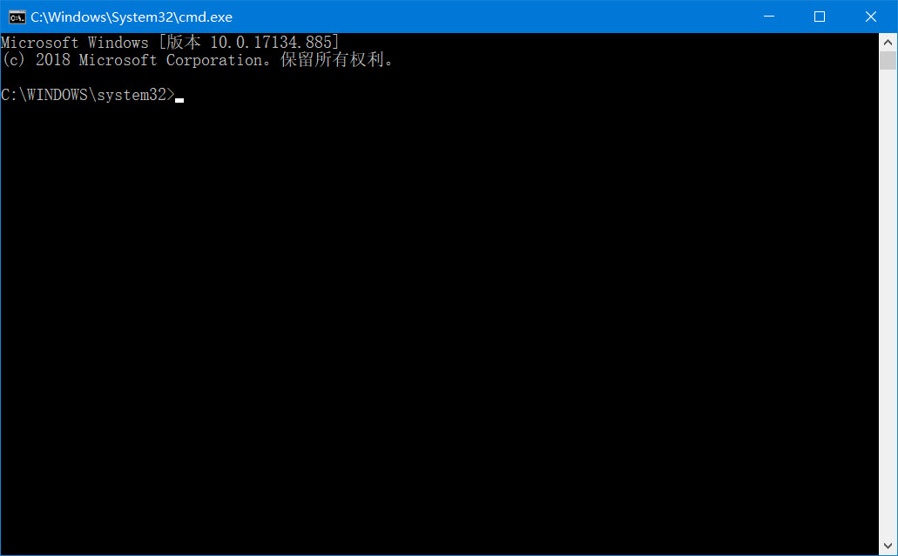
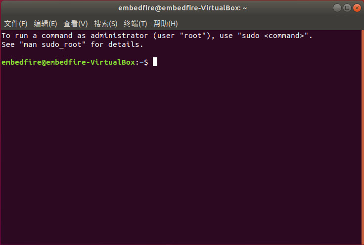
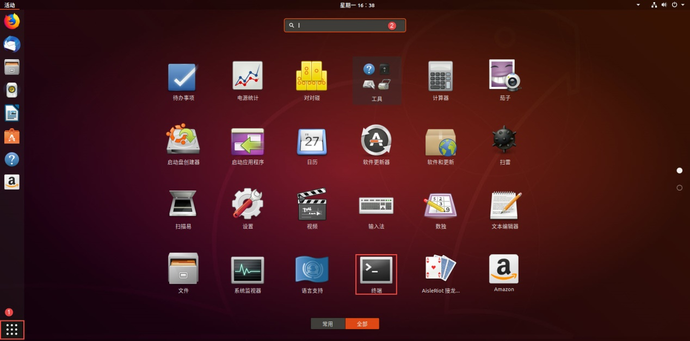
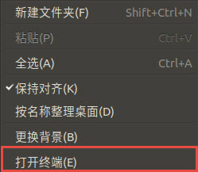
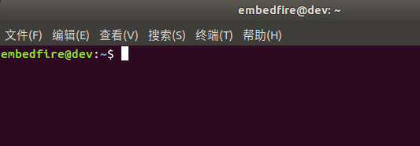
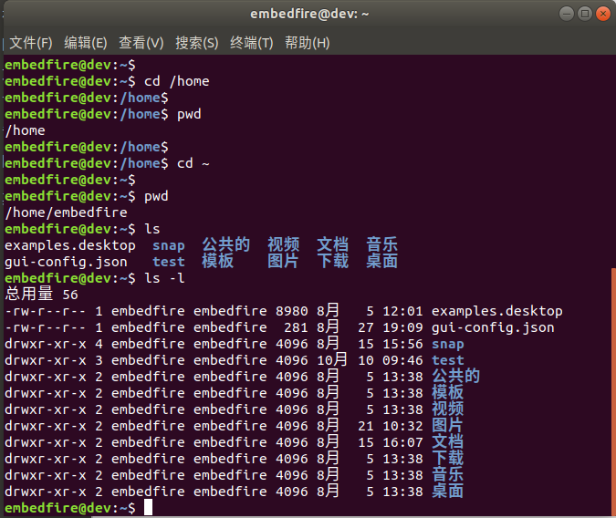
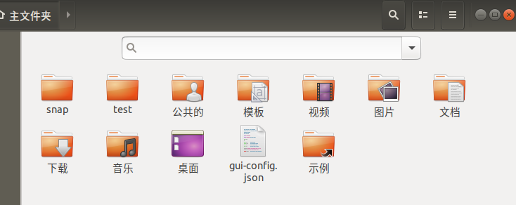
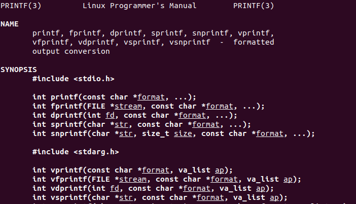
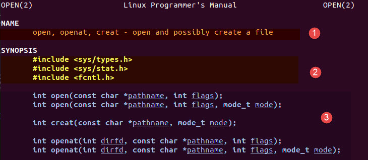

使用Linux命令行
---------------

使用桌面Ubuntu的一大好处是它的对用户很友好，日常的基础应用都可以通过它的图形界面完成，但界面做得再完善，还是有很多操作无法通过界面完成的，因为绝大部分程序本身根本就不提供界面，或者界面只提供一小部分常用操作。但是几乎所有的程序都能通过命令行来调用运行，并且通过命令行提供丰富的操作选项。尤其是做开发时，不要总想着有IDE，有当然好，但我们要接受只能使用命令行的处境，实际上，用多了就习惯了。

Linus
Torvalds（林纳斯）在其自传中提到，他在编写Linux操作系统内核的时候，首要目标就是让Linux系统能兼容正常运行Unix下的Shell程序。因为Shell是命令行解释器，它的Linux系统若能兼容Shell，那么大部分类Unix的程序也很容易做到兼容了。

在早期的Unix系统与用户就是通过Shell进行交互的，如图
7‑1，Shell对外接受用户输入的命令，对内通过系统调用传递给内核，内核执行操作后把输出通过Shell呈现给用户，也就是说，Shell就是一个中间人。而Shell的英文原意“壳”，也是为了把它与内核区分开来。

图 7‑1 Shell与内核

在平时的交流中，有时我们会说打开Shell、终端（Terminal）或控制台（Console），严格来说它们实际上不是同样的东西，但只要明白，当我们说打开Shell、终端或控制台的时候，通常就是为了使用命令行控制系统。它们的严格区分如下，了解下即可：

-   Shell：指命令行解释器，常见的解释器有bash，sh，在Ubuntu系统默认用的是bash解释器，所以有时说bash也是指命令行。

-   终端（Terminal）：通常指用来运行Shell的程序，示场景的不同，如Ubuntu系统自带的叫本地终端，嵌入式开发板常常提供串口进行输入输出的串口终端，通过网络访问的ssh终端。

-   控制台（Console）：特指某些终端，通常是指它的物理形态，如带键盘和显示器的物理设备。

### 打开终端

实际上，在Windows也有终端，如图
7‑2是类似于Windows操作系统的cmd程序，而在Ubuntu的命令行终端如图 7‑3所示。

图 7‑2 cmd窗口（Windows）

图 7‑3 terminal窗口（Ubuntu）

>   在Ubuntu下，可通过如下方式启动终端：

-   第一种方式是最简便最快捷的，通过快捷键Ctrl+Alt+T，可以快速打开一个命令行终端；

-   第二种方式是搜索功能，如图
    7‑4所示，点击处显示全部的应用程序，然后在处输入“terminal”，就可以找到我们想要的命令行终端。

图 7‑4 打开terminal窗口

-   第三种，在桌面点击鼠标右键，选择“打开终端”，如图 7‑5所示。

图 7‑5 使用鼠标打开终端

### 命令提示符

图 7‑6 命令提示符

如图
7‑6，打开终端后，我们可以看到终端本身显示了一行字符，而且按回车后会重复出现：

embedfire\@dev:\~\$

实际上这行提示符分成以下几个部分：

-   embedfire：显示的是当前的登录用户，图 7‑6现在使用的是 embedfire用户登录。

-   \@：分隔符号，可理解为at，表示embedfire用户at主机dev上。

-   dev：当前系统的主机名。

-   “:” ：分隔符号。

-   \~：冒号后表示用户当前所在的目录，此处的波浪线表示当前用户的家目录，即“\~”的含义为/home/embedfire目录。

-   \$：命令提示符，Linux
    用这个符号标识登录的用户权限等级。如果是超级用户，提示符就是
    \#，如果是普通用户，提示符就是 \$。

### 小试牛刀

废话少说，请亲自尝试在终端中输入如下命令，注意如果使用了中文输入法的话，要记得把它切换回英文模式，另外，在以下命令中的波浪号“\~”也是英文符号，还要注意终端中所有的内容都是区分大小写的：

\# 在后面的说明中，\#号表示注释，它后面的内容不要输入到终端中

\# 在后面的说明中，\#号表示注释，它后面的内容不要输入到终端中

\# 从下面开始是你要在终端中输入的命令（不包括\#号后的内容）：

cd /home \# 切换到/home目录

pwd \# 显示当前目录

cd \~ \# 切换至\~目录

pwd \# 显示当前目录

ls \# l是字母L的小写，不要把l输入成数字1或字母i的大写

ls -l \# 同上，两个l都是字母L的小写

每行命令输入后按回车，Shell就会对输入的命令进行解释，执行后输出，运行结果如图
7‑7所示。

图 7‑7 切换目录后的命令行提示

>   以上各行命令的意义如下：

-   cd /home ：执行
    “cd”命令，并以“/home”作为参数，表示切换至/home目录，命令执行后，我们可以看到命令提示符已变为
    ：

从 embedfire\@dev:\~\$

变为 embedfire\@dev:/home\$

>   即其中的波浪符号“\~”已变成“/home”。

-   pwd：执行“pwd”命令，表示输出当前所在目录，可看到它的输出为“/home”，与命令提示符中的是一致的。

-   cd \~ ：再次执行
    “cd”命令，并以“\~”作为参数，表示切换至“\~”目录，命令执行后，我们可以看到命令提示符中的路径已由“/home”变回“\~”。

-   pwd：再次执行“pwd”命令，输出当前所在目录，可看到它的输出为/home/embedfire，是当前用户的家目录，与命令提示符中的“\~”表示的意思是一致的。

-   ls
    ：执行“ls”命令，（注意这是字母L的小写，不是数字1也不是字母i的大写），该命令表示列出当前目录下的内容，可以看到它的输出与图形界面看到的是一致的，如图
    7‑8，而且在终端中还以不同的字符颜色对文件夹与文件进行了区分。

>   C:\\Users\\flyleaf\\AppData\\Roaming\\Tencent\\Users\\772406599\\QQ\\WinTemp\\RichOle\\EVBK)XS%7YKF}\@M3MK9O}BC.png

图 7‑8图形界面下的家目录内容

-   ls -l ：执行“ls”命令，并带“ -l
    ”（同样地，注意这是L的小写，不是数字1也不是字母i的大写）选项，该选项表示以列表的形式列出目录下的详细内容，可看到它比普通的ls命令多了很多内容，具体我们后面再分析。

### 命令的格式与帮助

#### 命令的格式

通过以上的一些命令示例，我们大致可以归纳一下命令的格式：

command [-options] [argument]

命令的组成一般分三部分，每部分之间使用空格隔开，说明如下：

-   command：命令名，如前面的cd命令，pwd命令，ls命令。

-   \-options：命令的选项，使用“-”开头的或“--”开头，如前面示例“ls
    -l”中的-l选项，命令会根据具体的选项执行不同的操作。使用“-”时一般是选项的简写，一些选项可以同时使用，“ls
    -la”等价于“ls -l
    -a”，即同时使用“l”和“a”选项。而“--”一般后面带选项的全名，如“ls -a”等价于“ls
    --all”。

-   argument：命令参数，如前面cd命令中以“/home”可“\~”参数作为路径名。

在命令格式中，使用“[
]”括起来的内容表示它不是要求必需的，例如前面使用时cd命令时没有带选项，使用pwd命令不带选项及参数。

#### 命令的帮助

Linux下系统本身就支持数不清的命令，不同的命令又带不同的选项，输入的参数往往又有不同的意义，除了丢下一句“用多了就会记住”这不负责任的说法外，使用命令其实还是有一些门道的。

每个命令都会带有一个“-h”
或者“--help”的参数，可以用来打印一些帮助说明。比如，现在不知道ls的选项a有什么用法，那么就可以执行下面的命令：

ls --help

![C:\\Users\\flyleaf\\AppData\\Roaming\\Tencent\\Users\\772406599\\QQ\\WinTemp\\RichOle\\S%0ZJL1]ZN(D06\$QR7[)ELH.png](media/2664ee56e98565512d1d962e4308a5d9.png)

图 7‑9 --help参数

从图 7‑9圈出来的地方，可以知道参数a可以只列出隐藏的内容。现在执行命令：

ls –a

图 7‑10 列出隐藏文件

如图
7‑10，可看到该执行后比直接用“ls”命令多列出了很多以“.”开头的内容，在Linux下以“.”开头命名的文件或目录默认为隐藏文件，而ls的“-a”选项可以把它们显示出来。

补充说明一下，帮助信息中的“-a”后面还有“--all”参数，这两个参数是等价的，只不过“--all”会比“-a”好记。

#### 自动补全

有些时候我们甚至连命令的全称都想不起来，这时可以用到命令行的自动补全功能。就是键盘上神奇的“Tab”键。

假如我们知道有个命令是以“whic”开头，但想不起全称，那么我们可以在终端输入“whic”然后按一下“Tab”键（键盘上字母Q的左边），它会自动补全命令为“which”。

图 7‑11 按下Tab键的自动补全

如果我们只记得命令是以“wh”开头的话，按一下“Tab”键发现它没反应（如果接入了耳机可以听到一下提示音），这时我们尝试按两下“Tab”键，如图
7‑12。

图 7‑12按两下Tab的提示

终端输出了好多以“wh”开头的命令，如which，who，whoami等。

所以按一下“Tab”键时如果只有一个匹配的内容时它会自动补全，按两下“Tab”键则会列出所有的匹配项。

“Tab”键除了用来补全命令名，还可以自动补全路径，如我们使用cd命令输入“/home”参数时，先输入“/ho”然后按下“Tab”键，它会把“/ho”自动补全为“/home”路径名，如图
7‑13。这在使用命令行时是频繁使用的技巧，能减少我们的输入，而且不容易出错。

图 7‑13 自动补全路径

如果对命令只记得大概，也可以大致地乱敲一通，如果运气好，按下回车后如果终端找不到这个命令时它会输出类似命令的提示，我们可以根据提示来了解。我们输入“whihc”回车后如图
7‑14，它提示我们找不到“whihc”命令，并询问我们想输入的是不是“which”。

![C:\\Users\\flyleaf\\AppData\\Roaming\\Tencent\\Users\\772406599\\QQ\\WinTemp\\RichOle\\JPD\$1LFH]PD])8TW{8O%{\@G.png](media/e77039be8af89c92edeb3ca5bdd6ad70.png)

图 7‑14 whihc的提示

#### 命令的退出与取消

在应用中我们有时会想要中止命令的执行，或者命令输入到一半的时候觉得输错了不想继续，这时我们都可以通过“Ctrl”+“c”的组合键来结束。

如在终端输入：

\# 在后面的说明中，\#号表示注释，它后面的内容不要输入到终端中

\# 在后面的说明中，\#号表示注释，它后面的内容不要输入到终端中

ping 127.0.0.1 \#尝试ping测试自己的网络地址127.0.0.1

\#以上ping命令会持续输出，按下“Ctrl”+“c”组合键来结束

图 7‑15 让命令停止执行

又例如，我们在终端输入了以下内容，然后又不想让它执行，使用删除键一个个字符删除很麻烦，也可以通过“Ctrl”+“c”的组合键来取消：

\# 在后面的说明中，\#号表示注释，它后面的内容不要输入到终端中

\# 在后面的说明中，\#号表示注释，它后面的内容不要输入到终端中

ls adfadfadsfadsfa

\#输入后不想运行以上命令，按下“Ctrl”+“c”组合键来结束

图 7‑16 取消命令输入

#### 命令究竟是什么

命令究竟是什么，当我们敲下命令“ls”后，Shell究竟做了什么事情。在《5.3.1
/bin目录》小节中提到，/bin目录下包含了很多命令，如图
7‑17，可看到ls、lsblk、lsmod、mkdir等命令程序。

图 7‑17 /bin下的内容

在终端中，我们使用which命令可以查看指定命令的路径，如查看ls、pwd、cd命令：

\# 在后面的说明中，\#号表示注释，它后面的内容不要输入到终端中

which ls \# 查看使用的是哪个ls命令

which pwd \# 查看使用的是哪个pwd命令

which cd \# 查看使用的是哪个cd命令

图 7‑18 查看命令的路径

如图 7‑18可了解到ls命令实际是/bin/ls程序，pwd命令实际是/bin/pwd程序，而which
cd命令没有输出，因为cd命令是Shell自己内部的程序。

我们在Shell中输入ls命令与输入/bin/ls的作用是一样的，当我们输入Shell时，它会到预定的目录下查找有没有该程序，如果有就使用命令选项及参数调用该程序执行，并把程序的输出再呈现出来。而这个预定的目录我们可以通过如下命令来查看：

\# 在后面的说明中，\#号表示注释，它后面的内容不要输入到终端中

echo \$PATH \# echo是输出命令，而“\$PATH”是一个变量，表示输出变量内容

图 7‑19 打印PATH环境变量

“\$PATH”是终端使用的路径环境变量，它使用“:
”进行分隔，表示Shell将会在这些路径下寻找命令程序，在其中我们可以看到/bin路径。也就是说，“\$PATH”
路径环境变量让我们输入命令时省去了输入完整路径的麻烦，而命令的本质大都是在文件系统中的一些应用程序。

### 常用命令

下面我们列出一些常用命令的讲解，请都亲自在终端里尝试运行一下。

#### cd命令

cd命令是change
dir的简写，它可以把终端当前所在的路径切换至目标路径。该命令的格式如下：

cd [目录名]

格式说明中 “目录名”就是要切换至的路径，若目录名称省略，则切换至当前用户的 home
目录 。

除某些有特殊要求的应用程序，Linux自带的所有命令在终端运行时，“目录名”都可以使用绝对路径或相对路径。

例如当前终端所在的路径为“/home/embedfire”，那么以下两个命令是等价的：

\# 在后面的说明中，\#号表示注释，它后面的内容不要输入到终端中

\# 假如当前目录为/home/embedfire

cd test

cd /home/embedfire/test

它们都表示切换至“/home/embedfire/test”目录，这其中的“test”就是相对路径，而“/home/embedfire/test”是绝对路径。

特别地，我们需要知道目录的如下表示：

-   “\~”：波浪号，表示为当前用户的 home 目录

-   “.”：一个英文句号，表示当前目录

-   “..” ：两个英文句号，表示当前目录的上一层目录

-   “/” ：斜杠符号，表示为根目录

-   “-”：减号，不是目录，但作为cd命令的参数时可以返回上一次cd切换前的目录。

我们尝试执行以下命令，进行目录切换实验，注意其中的embedfire是当前的用户名，具体请根据自己的用户名进行修改。

\#在后面的说明中，\#号表示注释，它后面的内容不要输入到终端中

cd / \# 切换至根目录

ls \# 列出当前目录的内容（根目录）

cd - \# 返回至上一次的目录（家目录）

cd .. \# 切换至上一级目录

ls \# 列出当前目录的内容（home目录）

cd embedfire \# 切换至embedfire目录（请把embedfire换成自己的用户名）

注意以上命令中，命令名cd与路径名之间是有空格的，实际上包括以后使用的所有命令中，命令名，命令选项以及命令参数之间都是要有空格分隔开的。

图 7‑20 cd命令实验

图
7‑20中执行切换至根目录的命令后，命令行提示符中的目录就变成“/”，且可以用直接用ls列出了当前的文件，最后再通过“-”参数切换回了用户的家目录。

#### mkdir命令

mkdir命令是make
directory的简写，它可以在文件系统中创建一个新的目录。其命令格式如下：

mkdir [-p] 目录名

命令格式中的“目录名”就是要创建的目录路径，“-p”选项可以不输入，若使用了“-p”选项，当创建的目录名包含的上级目录不存在时，它会自动创建所有不存在的目录。

我们尝试执行以下命令：

\#在后面的说明中，\#号表示注释，它后面的内容不要输入到终端中

ls \# 列出当前目录的内容，此时没有testdir目录

mkdir testdir \# 创建目录testdir

ls \# 列出当前目录的内容，发现多了testdir

mkdir other/test \# 创建目录other/test，因为other不存在，报错

mkdir -p other/test \# 使用 -p 选项创建目录other/test

ls \# 列出当前目录的内容，发现other目录

ls other \# 列出other目录的内容，发现test目录

![C:\\Users\\flyleaf\\AppData\\Roaming\\Tencent\\Users\\772406599\\QQ\\WinTemp\\RichOle\\6Y47SNX7%\@\$DOL_{]EQSTCG.png](media/44dce2b4794511fede7a35a0ef57864b.png)

图 7‑21 mkdir命令实验

#### touch命令

touch命令可以创建不存在的文件，或者touch通过参数修改目录或文件的日期时间，就是摸一下，更新它的时间。

它的命令格式如下：

touch 文件名

尝试执行如下命令：

\#在后面的说明中，\#号表示注释，它后面的内容不要输入到终端中

touch helloworld \# 在当前目录下创建一个名为helloworld的文件

ls \# 显示当前目录下的内容

使用touch命令，新建一个helloworld的文件，然后使用ls命令来查看文件是否被创建，执行结果如图
7‑22所示。

![C:\\Users\\flyleaf\\AppData\\Roaming\\Tencent\\Users\\772406599\\QQ\\WinTemp\\RichOle\\6]V7KQ0{I\~[T3G2{7VEGNCA.png](media/79e43f31210c8b2d85a4366b4c762f2c.png)

图 7‑22 touch指令

#### ls命令

ls命令是list的简写，在前面我们已经频繁使用，它是Linux下最常用的指令，功能为显示指定目录下的内容（文件及子目录)
，还可以查看文件大小，修改日期等等信息。

ls命令格式如下：

ls [选项] [目录]

当“目录”参数省略时，它会列出当前目录的内容。

除了基本的显示，ls命令还有以下常用选项：

-   \-a： 显示所有文件及目录
    (ls内定将文件名或目录名称开头为“.”的视为隐藏档，不会列出)

-   \-l
    ：注意这是字母L的小写，除文件名称外，将文件型态、权限、拥有者、文件大小等信息详细列出

-   \-t ：将文件依建立时间之先后次序列出

-   \-A： 同 -a ，但不列出 “.”(当前目录) 及 “..”(父目录)

-   \-R ：若目录下有文件，则该目录下的文件也会列出，即递归显示

尝试执行如下命令：

\#在后面的说明中，\#号表示注释，它后面的内容不要输入到终端中

ls \# 列出当前目录的内容

ls -a \# 显示当前目录下的所有内容

ls -A \# 显示当前目录下除“.” 及 “..”外的所有内容

图 7‑23 ls命令带参数a和A

从图 7‑23可以看到，缺省参数下的ls命令只能列出非隐藏的文件或者文件夹，而ls
–a或者ls
–A这两条命令会把所有文件，包括隐藏文件在内都罗列出来。在linux中，以点“.”开头命名的文件在系统中被视为隐藏文件。不过ls
–a 和 ls –A这两个命令的执行结果，区别在于是否列出“.”和“..”。

除此之外，在终端上罗列出来的文件是白色的字体，而文件夹是淡蓝色的字体，以此来区分文件和文件夹。

特别地，有时我们需要查看文件的详细信息，可以使用“-l”参数，我们尝试执行以下命令：

ls -l

可以看到图 7‑24
参数l的执行结果的结果，得到当前目录下所有文件所占用的空间总和以及一个7个字段的列表。

图 7‑24 参数l的执行结果

各个字段的说明如下：

第一字段：文件属性

文件属性共有十个字符，第一个字符代表文件的类型，字符“-”
表示该文件是一个普通文件；字符“d”是dirtectory(目录)的首字符，表示该文件是一个目录。

后面的九个字符，每三个为一组，分别表示文件拥有者的权限、文件所属组拥有的权限以及其他用户拥有的权限。字符“r”代表的是读（read）权限，字符“w”代表的是写（write）权限，字符“x”代表的是执行（execute）权限。

第二字段：链接占用的节点/子目录的个数

第二字段的含义，主要取决该文件的类型，如果是文件的话，则表示该文件所具有的硬连接数。某个文件的第二字段如果等于1的话，代表没有其他指向该文件的硬连接。

根据 Linux
系统存储文件的特点，链接的方式可以分为两种，分别是硬链接和软连接（符号连接）。软链接，类似于Windows操作系统的快捷方式。而硬链接，则是相当于把该文件复制一份，同时加上自动更新。当我们修改了硬链接文件的内容，源文件也会被修改。当为某个文件创建硬链接时，该字段的值便会加1。可以使用ln命令创建软链接和硬链接，当前只要知道有这回事即可，先不要纠结软链接和硬链接的概念。

对于文件夹来说，第二字段则表示该文件夹下有多少个子目录。空文件夹的话，该值默认等于2，这是因为包含了“.”和“..”子目录。

第三字段和第四字段：文件拥有者和文件所在的组

Linux系统属于多用户系统，每个文件都有它的拥有者。结合第一字段的后九个字符，一般只有文件拥有者有权利去修改文件。当然，对于root用户有权利去修改任何文件。以“视频”文件夹为例：

图 7‑25 视频文件夹

结合图
7‑26，进行理解：对于文件拥有者embedfire，它拥有对该文件夹的读、写、执行的权限，对于在embedfire分组的其他成员xiaoming，就只可以进行读、执行的权限。还有位于Other分组的用户xiaohong，也是只有读、执行的权限。

图 7‑26 Linux分组

第五字段：文件所占用的空间(以字节为单位)

第五字段表示文件大小，在Linux中，目录是一个特殊的文件。

第六字段：最近访问（修改）时间

第五字段表示文件最近访问的时间，使用touch命令，可以修改文件的第六字段。

第七字段：文件/文件夹名称

#### cat命令

cat命令是concatenate的简写，译为串联，即它可以把两个内容串联起来，我们通常使用它在终端下输出文件的内容进行查看。

命令格式为：

cat 文件名

前面我们使用gedit编辑器保存了一些内容到test123.txt文件上，此处可以使用如下命令把它的内容输出到终端：

cat test123.txt

图 7‑27查看文件内容

#### echo命令

echo命令的功能是在终端上打印一段文字，也可以把终端的变量内容打印出来。

其命令格式如下：

echo “字符串”

echo 字符串

echo \$变量名

使用echo命令时，带双引号和不带双引号的效果是一样的，使用引号时，要注意用英文符号。

我们尝试执行如下命令：

\#在后面的说明中，\#号表示注释，它后面的内容不要输入到终端中

echo “test” \# 打印字符串test

echo test \# 打印字符串test

echo \$PATH \# 打印环境变量PATH

echo “\$PATH” \# 打印环境变量PATH

![C:\\Users\\flyleaf\\AppData\\Roaming\\Tencent\\Users\\772406599\\QQ\\WinTemp\\RichOle\\}\`PD2A]B]R]P3I\@K\$W4\`I7D.png](media/ce0a7f02ae7079c12bb5b9d016b41dbd.png)

图 7‑28 使用echo打印字符串或变量

#### 输出重定向到文件

在上面看到命令执行后都是输入到终端显示，有时我们希望把命令执行的结果保存到文件进行分析，这时我们可以使用输出重定向到文件的控制符“\>”或“\>\>”，其中“\>”会直接用输出覆盖原文件，而“\>\>”则把输出追加到原文件的末尾。

使用格式如下：

命令 \> 文件名

命令 \>\> 文件名

重定向时文件不存在会自动创建。

尝试执行如下命令：

\#在后面的说明中，\#号表示注释，它后面的内容不要输入到终端中

echo test \> file.txt \# 把echo test的输出重定向至file.txt文件

cat file.txt \# 查看file.txt文件的内容

echo abc \> file.txt \# 把echo abc 的输出重定向至file.txt文件

cat file.txt \# 查看file.txt文件的内容

echo 123456 \>\> file.txt \# 把echo 123456的输出重定向追加至file.txt文件

cat file.txt \# 查看file.txt文件的内容

ls \> file.txt \# 把ls命令的输出重定向至file.txt文件

cat file.txt \# 查看file.txt文件的内容

图 7‑29 输出重定向到文件

如图
7‑29演示了echo命令和ls命令的输出重定向至文件file.txt中，重定向执行命令后输出不会显示在终端上。

#### rmdir命令

rmdir命令是remove directory的简写，它的功能是删除空的目录。

命令格式如下：

rmdir [-p] 目录名

与mkdir的选项类似，-p可以用来递归删除目录，如果子目录删除后其父目录为空时，也一同被删除。

特别地，rmdir命令只能够用来删除空目录，当删除一个非空目录时，会提示“删除“某某某”目录失败：目录非空”，所以实际上这个命令用得并不多。

下面我们执行以下命令，来删除我们上面创建testdir目录和其other/test及其子目录。

\#在后面的说明中，\#号表示注释，它后面的内容不要输入到终端中

rmdir testdir \# 删除testdir目录

rmdir -p other/test \#
删除other/test目录，若删除后other为空，把other目录也删除掉

![C:\\Users\\flyleaf\\AppData\\Roaming\\Tencent\\Users\\772406599\\QQ\\WinTemp\\RichOle\\TR39G0\`HBPAJA_]\$\$X%LB(W.png](media/617eda6c360941ee64f71c8fc702e37c.png)

图 7‑30 rmdir命令实验

命令rmdir –p
other/test/是删除空子目录test，但由于参数p的作用下，删除了test目录之后，目录other也为空目录，因此other目录也会被一起删除。假如没有参数p的话，那么other目录依然会存在，读者可以自己尝试一下。

#### rm命令

rm命令是remove的简写，它的功能是删除一个或多个文件或目录。

其命令格式如下：

rm [选项] 一个或多个文件/文件夹名

使用rm命令删除内容时，文件是会被直接永久删除的，它并不会放到回收站中再确认。所以在使用rm命令前，一定要考虑清楚。特别时如果你使用的是系统管理员账户或者通过后面介绍的sudo命令获取了系统权限，那么只需要一句命令就可以实现删库跑路，酿成大祸！

它支持的选项如下：

-   \-i：删除文件或文件夹前，终端会逐一询问确认

-   \-r：将目录及其包含的子目录或文件全部删除

-   \-f：忽略不存在的文件，无需逐一确认

虽然rm命令使用不当很容易造成严重后果，但不能因噎废食，而且趁我们现在的系统是刚安装的，没有什么重要内容，在家目录进行操作通常也不会影响到系统的正常运行，所以大可以放心去运行以下命令进行实验：

\#在后面的说明中，\#号表示注释，它后面的内容不要输入到终端中

\#先创建一些试验文件给后面删除

mkdir -p ABC/test \#创建ABC/test目录

ls \#列出内容

touch a.txt b.txt c.txt d.txt \#创建 几个测试文件

ls \#列出内容

先结合前面学习的mkdir和touch命令，在当前目录创建一个ABC目录，里面包含了一个子目录test还有a.txt，b.txt，
c.txt，d.txt，执行结果如图 7‑31所示。

![C:\\Users\\flyleaf\\AppData\\Roaming\\Tencent\\Users\\772406599\\QQ\\WinTemp\\RichOle\\4Y28]\~P\`_35{JX(4LI6AD\~1.png](media/a7172855e5fb2d73326069ac90c429e3.png)

图 7‑31 创建文件

##### 删除文件测试

\#在后面的说明中，\#号表示注释，它后面的内容不要输入到终端中

rm a.txt b.txt \#直接删除a.txt b.txt

rm –i c.txt d.txt \#询问式删除c.txt d.txt

执行上面两条命令的其中一条都可以完成删除任务。当带有参数i时，则会有询问是否删除文件，如果是，输入y；反之，则输入n。如图
7‑32所示，直接删除了a.txt，b.txt。使用询问式删除时，删除了c.txt，保留了d.txt文件。

![C:\\Users\\flyleaf\\AppData\\Roaming\\Tencent\\Users\\772406599\\QQ\\WinTemp\\RichOle\\3\@LUZ[S]\~UG]VD(HZ\$R_2\~4.png](media/c26cf814030d79651bc7886b906d4e07.png)

图 7‑32 删除文件测试

##### 删除非空目录

前面提到rmdir命令不能删除非空的目录，我们可以使用rm命令配合“-r”选项来完成：

rm –r ABC/

![C:\\Users\\flyleaf\\AppData\\Roaming\\Tencent\\Users\\772406599\\QQ\\WinTemp\\RichOle\\MI%LHIZ95TC2M_S]CJ)W]F0.png](media/ebc81606d09e87c6d37585ce9c126a1f.png)

图 7‑33删除非空目录

执行以上命令之后，就会把目录ABC以及子目录test，即ABC下的内容统统都删除掉。因此，为了防止误删文件，使用rm命令时尽可能加上参数i。

##### 选项-f的作用

执行以下两条命令，比较执行结果的差异：

rm a.txt

rm –f a.txt

图 7‑34 使用-f选项的差异

当使用第一条命令时，会提示“删除失败，找不到该文件”，但是当我们使用参数-f时，就忽略该提示。这里只是简单介绍一下该参数，日常使用中还是尽量不要使用该参数，以免造成无法挽回的损失。

#### sudo命令

sudo命令是switch user do的简写，意思是切换用户去做某件事情。

在Linux中，有一个名为root的超级用户。它可以做任何事情，权力越大，责任越大因此在日常工作中，若一时没注意输入了错误的命令，可能会导致系统崩溃，所以在Ubuntu下默认是不能用root用户登录的。但是在很多情况下我们又需要用到root的权限，如安装某个软件，若使用普通的用户会提示“权限不够”。这时候我们可以在需要root权限的命令前添加sudo命令，从而使当前用户获得root权限，并执行其后的命令。所以Ubuntu需要用sudo实际上是提醒我们接下来执行的命令有可能会影响到系统的关键内容，要小心操作。

sudo命令格式如下：

sudo 命令

使用sudo命令时会提示输入你当前的用户密码，而不是root用户的密码。请注意，你输入的密码不会显示在终端上，而且终端也不会随着你的输入而显示星号（\*）！自信地在键盘上敲入密码，然后按回车即可。

下面我们尝试使用sudo命令在需要root权限的目录进行操作：

\#在后面的说明中，\#号表示注释，它后面的内容不要输入到终端中

cd /home \# 切换至/home目录

touch test.txt \# 尝试在当前目录创建test.txt文件

sudo touch test.txt \# 使用sudo增加权限，创建test.txt文件

\# 输入密码时终端也不会随着输入而显示星号（\*），输入完回车即可！

\# 输入密码时终端也不会随着输入而显示星号（\*），输入完回车即可！

\# 输入密码时终端也不会随着输入而显示星号（\*），输入完回车即可！

rm test.txt \# 尝试删除test.txt文件

sudo rm test.txt \# 使用sudo增加权限，删除test.txt文件

图 7‑35 使用sudo执行需要权限的操作

如图
7‑35，当前用户是embedfire用户，切换至/home目录后，它没有往该目录写入文件的权限，所以直接用touch命令尝试创建文件时提示权限不够。当我们在touch命令前增加sudo命令，并输入正确的用户密码后获得了权限，所以文件被成功创建。类似地，当我们直接尝试用rm命令删除文件时，也会提示权限不足，再增加sudo后即可删除。而且可以发现这时不需要再次输入密码了，也就是说认证成功后能维持一段时间，但是使用命令时，还是要添加sudo操作。

部分用户在使用系统时，会觉得使用sudo命令很麻烦，有时干脆直接切换到root用户去进行开发，这常常会导致各种问题。例如部分构建工具直接不支持root用户运行，有时我们用了root用户去解压或拷贝工程文件，一不注意又使用普通用户去运行，这时会因为普通用户没有权限而出错，但找起原因却很浪费时间。所以，我们强烈建议在开发及日常使用时，不要使用root用户。

#### clear命令

终端执行各种命令后会保留之前的内容在屏幕上，如果觉得碍眼，可以直接运行clear命令清除：

clear

#### reboot/poweroff命令

在终端上，reboot/poweroff命令来控制系统的重启与关机。直接使用如下命令即可：

reboot

poweroff

### man命令

man命令值得我们为它独立一小节来进行说明。

前面只列出了几个常用命令，对于Linux系统来说，这些只不过是九牛一毛。那么多的命令，而且有的命令还有那么多的参数，怎么可能记得住？除了--help选项外，Linux还提供了一个man命令，可用于查看Linux系统自带的参考手册，该手册包含非常丰富的内容，甚至在我们进行编程开发时还可以使用它来查看函数的接口。

##### man基本用法

man命令格式：

man [要查询的内容]

使用起来非常简单，如我们想查看ls命令的说明，直接输入如下命令即可：

man ls

![C:\\Users\\flyleaf\\AppData\\Roaming\\Tencent\\Users\\772406599\\QQ\\WinTemp\\RichOle\\C5F]X28O3_1N9VKFWWZ819A.png](media/8298a187493411a8fbd9330a70e05f3e.png)

图 7‑36 man中的帮助说明

按键盘方向键的“↑”“↓”键可以实现上下切页。按“q”键可以退出手册。

##### man手册的章节

关于man手册本身的使用，可以使用如下命令查看：

man man

图 7‑37 man man指令

从图
7‑37可了解到，除了Shell命令外，还可以看到man手册支持共9种类型的内容，如第一章是关于Shell命令，第二章是系统调用（内核提供的函数）、第三章是库调用（程序库中的函数），如我们可以查看内核函数fork及C标准库函数printf的说明：

man fork

man printf

图 7‑38 fork函数的帮助说明

![C:\\Users\\flyleaf\\AppData\\Roaming\\Tencent\\Users\\772406599\\QQ\\WinTemp\\RichOle\\\~ZN7M7]]\@P}L5\`1}(Q\`\`PZE.png](media/d9382114b754deecce312e70511252e3.png)

图 7‑39 printf函数的帮助说明

说明页开头的 “FORK(2)”、
“PRINTF(1)”括号内的数字表明了它在man手册中的章节号。即此处的FORK页的说明是第二章的内容，正是我们要查询的内核函数说明（系统调用）。而此处PRINTF页面实际是第一章的内容，man手册的第一章是关于Shell命令的，在Shell中刚好有一个命令也是名为“printf”，所以它出现了这样的搜索结果，该页的说明不是我们想要的C库函数内容，C库函数的说明应位于man手册的第三章。

##### 查询指定章节的内容

man是按默认顺序来查找的，有时我们要查阅的内容可能在前面的手册出现，而它不是我们需要的内容，例如前面的C库函数printf
，或者查阅open系统调用函数时，出现的却是Shell的printf和openvt程序说明：

\#直接man open，它会按默认顺序搜索，结果搜索出了openvt的Shell命令说明

man open

图 7‑40 man手册章节1的openvt程序说明

在图 7‑40中可以看到OPENVT(1)说明页是在第一章节的，与PRINTF(1)类似。

解决这个问题可以通过指定章节号来查询，因为我们要查询的printf是C库函数、open是Linux的“系统调用”API，所以我们可指定它就在该章节查找，前面图
7‑37中的man
man命令输出中可看到“库调用”属于第3章，而“系统调用”是属于第2章，所以使用man命令时，我们通过“-s”选项指定它搜索的章节号：

\#通过-s指定搜索章节的内容

\#man手册的章节3是“库调用”相关的函数说明

man -s 3 printf

\#可以省略-s，使用以下命令是等价的

man 3 printf

\#man手册的章节2是“系统调用”相关的函数说明

man -s 2 open

\#可以省略-s，使用以下命令是等价的

man 2 open

图 7‑41 指定章节号查询出的printf函数说明

图 7‑42 指定章节号查找出的open说明

图 7‑42是man手册中关于open函数的用法，分为以下三个部分：

-   第一部分，通常是该函数的概述，介绍该函数的功能。open、openat、creat函数可用于打开文件，某些情况下也可用于创建新文件。

-   第二部分，使用该函数的时候需要包含哪些头文件，用户在使用open函数时需要包含上述的三个头文件，这也就是前面我们说的在Linux编程中，需要关注头文件的内容，往往可能因为漏包含了某个头文件，导致某个宏定义不能被识别，这也体现man手册的强大之处。

-   第三部分，则是该函数的具体原型，我们可以从这部分内容，了解到需要传递什么参数，每个参数的作用。

>   在以后的学习中，请养成使用man手册的习惯，它是最便捷和权威的说明书。
