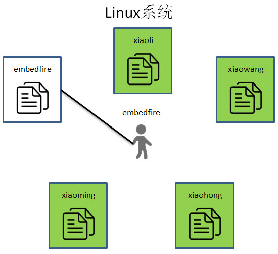
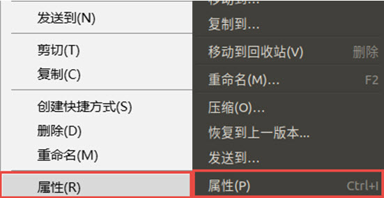
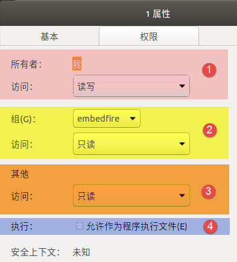

用户组与文件权限
----------------

### 用户及用户组

在早期的Windows操作系统，如Windows 95 和 Windows
XP，都是单用户操作系统。所谓的单用户操作系统，就是说在同一时间，只能由一个用户独自享用系统的全部硬件和软件资源。我们现在所使用的win7、win8以及win10都是多用户操作系统，与单用户操作系统恰恰相反，它支持多个用户能够同时访问和使用同一台计算机的全部硬件和软件资源，

在众多用户中，其中的一个用户administrator具有管理其他用户账号和计算机的全部资源的权限。我们在安装软件的时候，经常会看到“要以管理员身份运行该软件”，又或者是图
6‑1，实际上就是要求我们给予程序一些管理员的权限。

图 6‑1 以管理员身份运行

Linux操作系统，同样也是多用户操作系统，其中具有管理其他用户和计算机的全部资源的用户，称为root。前面提及过安卓系统，实质上也是基于Linux，安卓手机上常常提到的root权限，也就是获取最高的权限，就跟电脑获取超级管理员的权限是一样的。

在Linux中，每个用户都有一个特定的编号——UID，用于标识一个系统用户。Linux将标号0分配给root用户的uid，它可以分配给每个用户不同的权限，因此每个用户可进行的操作也不同。

我们可以通过id命令来查看当前用户的UID值（关于如何使用命令在下一章介绍，此处先了解）：

id

图 6‑2 当前用户的uid

图
6‑2中的gid用于标识当前用户所在的分组（Group），每个用户可以对应多个分组。就好像学校里面有音乐社，动漫社，文学社等社团，每个学生可以去参加多个社团，这样才能够接触到各种各样有趣的东西。Linux系统拥有多个分组，每个用户分组就相当社团，用户如果是多个用户组的成员，就可以访问其他分组对应的文件，前提是该分组的文件允许其他用户访问，这就需要了解大标题的另一个知识点：文件权限。

图 6‑3 Linux中分组情况

### 文件权限

在Windows系统中我们经常接触的文件属性，无非就是以下两种属性：只读、隐藏。

从字面上的意思，我们也很好理解。具有只读属性的文件，我们不能对文件的内容进行修改。而具有隐藏属性的文件，我们一般情况下是看不到的。

图 6‑4 Windows文件属性

在windows上，通过选中文件，然后右键调出菜单，就可以看到“属性”选项，那如何在Linux查看一个文件的属性？其实，查看方法和Windows相差无几，同样也是先选中一个文件，右键可以看到图
6‑5右侧的菜单。我们通过最下面的“属性”选项来查看某个文件的具体情况， 如图
6‑6所示。

图 6‑5 wins和linux右键菜单

图 6‑6 文件属性

Linux的文件属性，可以分为读权限、写权限、执行权限。读权限以及写权限，基本上和Windows操作系统是一样的。关于执行权限，是指可以加载到内存中，并由操作系统加载程序执行的文件。在Windows操作系统中，我们接触最多的应该是后缀为.exe的文件。但是对于Linux来说，它并不是通过后缀名来识别文件类型的，如果我们想要执行某个可执行文件，则需要为其添加执行权限，如图
6‑7 分配执行权限所示。

图 6‑7 分配执行权限

除此之外，关于Linux文件权限，还需要分三种情况：文件拥有者，分组成员以及其他分组成员，分别对应图
6‑6
文件属性的、、部分。该文件允许文件拥有者embedfire和位于embedfire分组的其他成员，对该文件的内容进行读写操作，而其他分组的用户则只能阅读该文件，并不能对该文件进行修改。如果我们想修改其他分组的文件，我们可以修改该文件的其他分组所拥有的权限。

在后面学会使用命令行后，我们可以通过chmod命令在终端快速地修改文件的权限。
