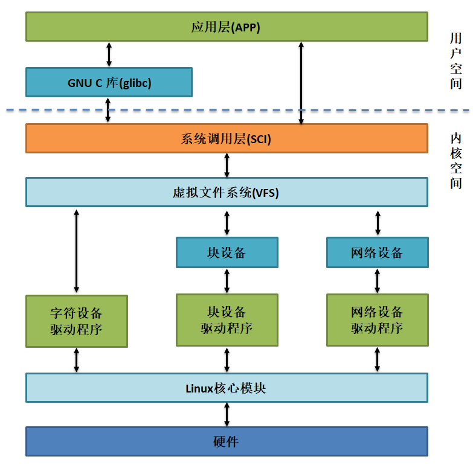

为什么学习Linux开发
===========================

本章主要从Linux的应用场景，程序员的技能学习，职业方向来讨论为什么需要学习Linux开发并对如何学好Linux开发提出了一些建议。

### Linux的应用场景

对于一般用户来说，因为经常接触PC、手机，可能会知道Windows、iOS、Andorid系统，但对Linux系统却知之甚少，这是因为
Linux的应用场景主要是服务器和嵌入式设备，在直面消费者的桌面系统领域并不占据优势。不过，从某种程度来说，Android系统也属于Linux的一种，毕竟它是基于Linux内核进行开发的，只是由于它规避了Linux的开源协议，不被Linux社区接纳。

Linux的应用场景主要是由其特点决定的，其特点主要有：开源、安全、稳定、网络功能强大、支持多种不同平台的处理器。

#### 服务器

服务器是指提供计算服务的设备，如网页服务器、文件服务器、数据库服务器、邮件服务器、域名服务器和代理服务器等。可以说我们在互联网上的所有操作，背后都是在跟服务器打交道。例如我们访问网页、网上购物、微信聊天、运行网络游戏、观看在线视频等一切需要联网才能正常进行的应用，其背后都由服务器作为支撑。

服务器的实体各种各样，小到单板电脑，大至计算机集群，实际上你正在使用的个人电脑，安装上对应的服务软件，通过网络给其它计算机提供资源，它也就变身成了一个服务器。服务器的本质也是计算机，只是通常来说它们没有显示器，不需要鼠标键盘。

在商业应用中，在服务器运行的操作系统主要有Linux、Windows和UNIX，其中由于Linux系统开源、使用成本低而且安全稳定，所以Linux在服务器使用的系统中占据了绝大多数。

感兴趣的读者可以访问Netcraft 网站 http://
www.netcraft.com，可以查询到其它网站是运行在什么操作系统上的，具体见图 1‑1和图
1‑2。

图 1‑1 Netcraft网站输入要查询的网址

图 1‑2 查询的网站使用的操作系统

可以查询到绝大部分知名网站都运行在Linux系统之上，包括微软官网：www.microsoft.com。而国内的一些银行官网则通常使用Windows
Server系统。

特别地，超级计算机也是特殊的服务器，目前全球TOP500的计算机运行的操作系统都是Linux。

#### 嵌入式设备

嵌入式设备是Linux系统的另一个主战场，这也是本书主要讲解的Linux应用方向。嵌入式设备的定义比较模糊，不过基本上把PC、集群服务器、超级计算机排除后，具有处理器（包括微控制器等）的，按设定程序运行的电子设备大都可以归类为嵌入式设备。

嵌入式设备种类非常丰富，包括日常生活中的手机、智能手表、各种家电、玩具、路由器、车载电子系统，工业应用中包括电力系统监控、环境监测、工业机器人、智能快递柜、手持POS机、地铁闸机系统、停车场管理、卫星、月球车等。

从嵌入式设备的种类就可以知道它们的应用场景是碎片化的，它们内部的电子系统一般会针对设备的功能做专用的控制。部分嵌入式设备不使用操作系统；部分使用freeRTOS等实时操作系统；而另一些高性能的嵌入式设备使用Linux系统。使用Linux系统的的嵌入式设备，往往是看中Linux系统的如下特性：

-   嵌入式设备使用的处理器多种多样，而Linux系统支持运行在x86、ARM、PowerPC、MIPS等不同平台的处理器上。

-   由于代码开源，可裁剪，非常适合针对特定场景进行定制，裁剪后的Linux内核加上文件系统可以做到50MB以内，这能够节省硬件资源和成本。

-   对各种编程语言、类库、编程框架支持良好，如python、java、C++等编程语言，Opencv、TensorFlow等类库和框架，使用freeRTOS等实时操作系统往往很难做到直接支持。

-   应用程序丰富，如音乐播放器、数据库等现成的应用可以直接使用。

-   网络功能强大，使得编写需要联网的应用程序非常方便。

### Linux职业方向

根据Linux的应用场景，社会对Linux技术人员主要分为服务器运维、应用软件开发及设备驱动开发方向。

#### 服务器运维

服务器运维工程师主要是负责搭建起运行环境，让服务器应用程序更高效、稳定、安全地运行在服务器上。如安装操作系统、部署代码运行环境、修复漏洞、监控服务器压力、分析日志等。

#### 应用软件开发

Linux应用软件开发就是开发基于Linux系统的应用程序。具体而言，应用程序也分服务器、桌面和嵌入式方向，服务器方向如网站后台、数据库系统等。服务器方向的应用程序开发通常跟操作系统的关系并不是很大；桌面开发就如同开发Windows系统下的QQ、WPS、串口调试助手等应用程序；嵌入式方向的软件方向主要是针对设备应用场景做针对性的开发，如扫地机器人、路由器的控制程序等。

#### 设备驱动开发

设备驱动，它的本质也是软件程序，不过它介于硬件与操作系统之间的层级，是硬件和操作系统之间的桥梁，具体见图
1‑3。

图 1‑3 驱动程序在Linux系统中的位置

对于不使用操作系统或使用小型实时操作系统（如freeRTOS）的设备来说，与硬件相关的驱动程序与应用程序往往混合在一起，因此常常不会对驱动与应用进行严格的区分，这也导致更换硬件平台时，应用程序移植困难。

使用了Linux系统的设备，硬件会由操作系统接管。Linux系统的一个重要设计哲学是一切皆文件。包括硬件设备，对于系统来说也是一个文件，所以系统向上层应用程序提供open、write、read、close等统一的文件操作接口，应用程序可以利用这些接口对设备文件进行访问，从而实现对硬件设备的初始化、写入、读取以及关闭等操作。

当系统接收到应用程序的这些访问请求时，它会向下查询对应设备具体的操作函数，然后调用相应的函数处理请求，而这些针对不同设备具体的操作函数就是设备驱动程序。因此，设备驱动就是这样一种把硬件与操作系统连接在一起的程序，Linux系统会提供统一的格式，设备驱动开发工程师根据具体的设备按照系统格式要求实现相应的设备操作函数。

本书主要针对嵌入式设备驱动开发的讲解，对于志在应用软件开发的工程师，也可通过本书的内容掌握Linux底层的相关知识，这对应用开发也是大有裨益。

### 程序员的宝库

Linux可谓是公开的宝库，它是开源世界的代表作，它的内核源代码是完全公开的，只要你愿意沉浸其中，必定收获丰富。通过学习Linux开发，会熟悉命令行的使用；可以了解到操作系统原理；学习常用数据结构，如链表、红黑树、哈希表等；了解开源社区的文化，学习各自优秀的代码实现，如常用的C语言库libc等；熟悉各种常用开发工具，如Git版本管理系统、GCC编译器。

并不是说从事传统MCU开发或Windows开发时不能学习到这些，只是这些内容往往被包装起来，要么直接无法追根溯源，要么隐藏起来了。但在进行Linux开发时，相关的内容是直接暴露给用户的，只要钻得够深，永远有惊喜等待着我们。例如，使用Keil或IAR开发时，我们不知道调用C语言库的printf函数后，具体究竟执行了什么；点击编译按钮时，集成的工具又为我们处理了一些什么内容，这些我们都很难了解到。

对于长期从事MCU开发的程序员来说，学习Linux开发会让人感叹，原来代码的世界一直在这里等着我！

### 如何学习Linux设备驱动开发

希望经过前面介绍Linux的应用场景、职业方向以及学习Linux对编程技能提升的好处，能让你更加坚定地开始学习Linux开发。那么该如何学习呢？对于Linux设备驱动开发工程师，会有如下基本要求：

-   学好英语

-   打磨C语言基础，要求熟练运用指针、结构体及各种C库的使用

-   熟悉Linux下编写基本的应用程序，如文件操作、在应用层控制硬件设备等

-   熟悉各种常用设备通讯协议，如UART、I2C及SPI等

-   熟悉不同的存储设备及其读写特性，如SDRAM、NAND FLASH、Nor FLASH等

-   熟悉Linux内核机制和各种驱动框架

-   对多任务和并发控制等应用自如

总而言之，Linux开发涉及非常庞大的知识体系，只有通过大量的动手实践和阅读才能深入掌握，同时，也不要局限自己，多了解一下Linux运维和应用开发相关的知识也很有帮助。在学习时，也多进行类比，如在熟悉Linux系统时，类比Windows下的习惯，编写程序时，多类比它与MCU开发时的异同。

学习设备驱动开发，建议要使用开发板。虽然使用QEMU软件可以模拟电路板，但对于初学者来说没有办法建立切实的概念，一切全凭想像，这样的学习如同架构在幻境之上，没法落地。也不要使用树莓派等设备，使用树莓派的爱好者很多，有活跃的社区，因而有非常多的资源可以参考，但这些都是利用树莓派制作应用。虽然在制作应用时可以参考，但因为树莓派使用的主控芯片公开的硬件资料比较少，而编写设备驱动时又必须了解芯片具体的各项特性和外设，对于设备驱动工程师来说，目标是制作一个树莓派，而不仅仅是把它当一个单板Linux设备来应用。

学习是一个螺旋上升的过程，学习到后面的章节，再回过头来再看一遍本书，会发现刚开始学习时以为自己了解的东西又深入了一遍。

### 推荐书单

-   《只是为了好玩》/《Just For
    Fun》，Linus的自传，通过它可了解Linux的发展史以及了解Linus其人的生活态度。

-   《奔跑吧Linux内核》，分上下两册，建议初学者仅学习上册。

-   《鸟哥的Linux私房菜》，该书主要针对Linux服务器运维人员，主要学习上册，了解Linux的日常应用。

-   野火《STM32库开发实战指南》，快速上手MCU开发并巩固C语言相关的知识。

-   野火《i.MX RT库开发实战指南》，i.MX 6ULL的外设与i.MX
    RT系列基本相同，可以通过它学习i.MX系列芯片的裸机开发进行过渡。

-   野火《RT-Thread内核实现与应用开发实战指南》和《FreeRTOS内核实现与应用开发实战指南》，针对嵌入式实时操作系统讲解，通过它们可掌握操作系统相关的概念。
